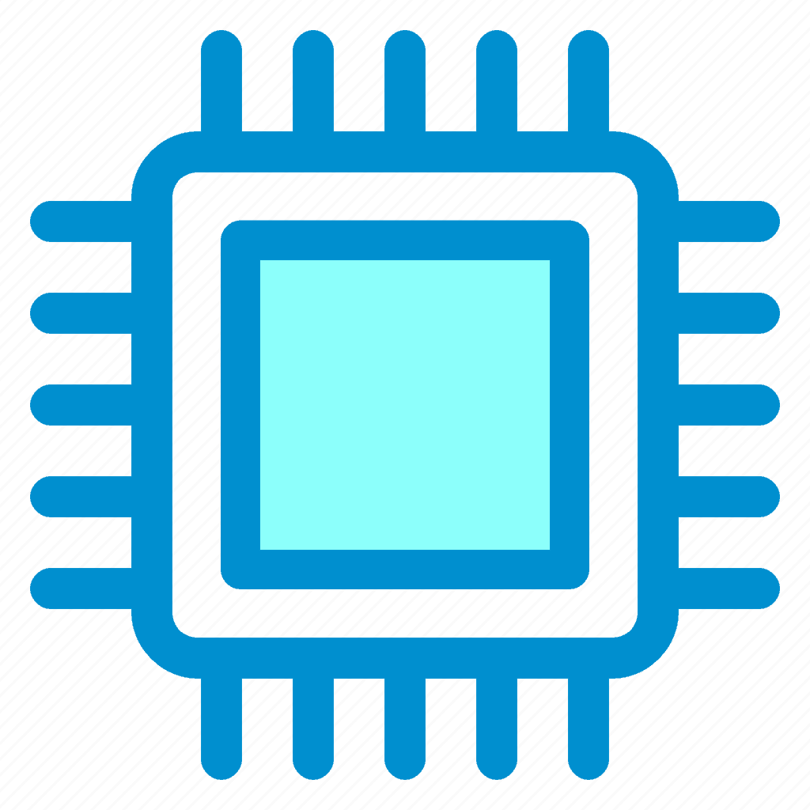
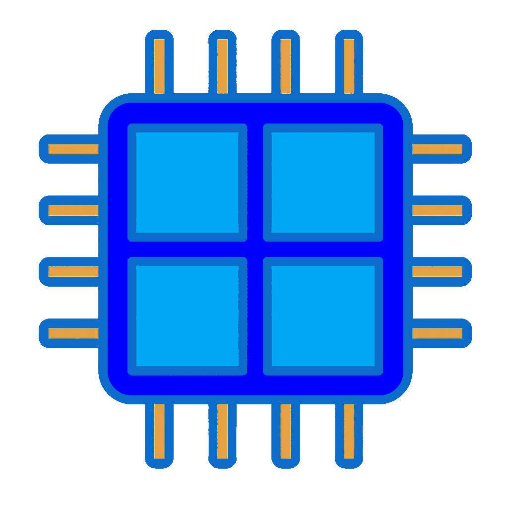

# SensorPanel

**SensorPanel** is a lightweight Java-based display for real-time PC telemetry. It is intended to be displayed on a dedicated
small-size monitor within a Windows gaming PC.

https://github.com/user-attachments/assets/3ba3a664-50ba-4f8d-a4d4-867eb311013d

The above demo is sped up 4x and recording was started just before launching and playing a graphics-intensive video game (with
some remote file transfers running in the background). Below is what the panel looks like running within a gaming computer.


## Table of Contents
1. [Features](#Features)
2. [Layout](#Layout)
3. [Performance](#Performance)
4. [Input Sources](#InputSources)
5. [Use Cases](#UseCases)
6. [How to Use](#HowToUse)
7. [My Hardware](#MyHardware)
8. [Development Notes](#DevelopmentNotes)
9. [Planned Features](#PlannedFeatures)
10. [Known Bugs](#KnownBugs)

<a name="Features"></a>
## Features

SensorPanel is a sleek, modern, and minimal live display. It is lightweight and highly customizable. It is currently used to
display data from HwInfo, FanControl, and TP-Link Kasa, though with minimal code work it can display any value from any source. It
is intended to be used on a dedicated monitor within a Windows gaming computer, though it can be used on any monitor and any
Windows computer or laptop.

When launched, it will automatically identify the dedicated monitor for the SensorPanel and display there. The user interface
provides a right-click menu which displays a number of options, including:
 - Enable or disable "always on top"
 - Show or hide the frame border
 - Make the frame resizable
    * Note: UI components do not scale with resizing
 - Lock or unlock frame position
 - Reset to all defaults
    * Including repositioning the windows on the sensor panel monitor

The program is intended to be launched at startup and must be launched with administrative privileges due to its integration with
HwInfo, which requires administrative privileges to access hardware values. Because SensorPanel is launched as an admin, it is
also conveniently used to launch other startup programs that require admin permissions, which in my case includes:
 - FanControl
 - MSIAfterburner
 - RivaTuner Statistics Server
 - HwInfo

Each sensor being monitored can have a custom expected range set for it. If the value falls outside the expected range, a warning
will be emitted via stderr (see [Sensor.java](src/Sensor.java)). The program logs all warnings, errors, and checked exceptions.

Finally, the polling or monitoring rate of all sensor providers is asynchronous, parallelized, and can be customized for each
source being pulled from (e.g. HwInfo polling rate is set to 3 seconds).

<a name="Layout"></a>
## Layout


Component layout, described left-to-right and top-to-bottom within each panel:
 - Left panel
    * 🟪 RAM usage
    * 🟩 VRAM usage
 - Top left panel
    *  Single-core CPU usage (max usage seen across all individual cores)
    *  All-core CPU usage
    *  CPU temperature
 - Bottom left panel
    *  GPU power consumption
    *  GPU utilization
    *  GPU temperature
 - Center right panel
    *  Air temperature within the case
    *  Coolant temperature
 - Right panel
    *  Total system power consumption
        - Measured at the wall
    *  Secondary power usage
        - Calculated as (total system power consumption - CPU power consumption - GPU power consumption)
    *  Cost to operate computer per hour
        - Based on the current total power consumption and the electricity price per kwh in my area. Note that monitors can be
          quite power-hungry and are not included in this value.
    *  Frames per second
    *  System upload usage
    *  System download usage

<a name="Performance"></a>
## Performance

Benchmarking was performed on a system with a Ryzen 9 7950x3D at stock settings.

 - **CPU Time**: 1.03 seconds over 60 seconds
 - **Single-core CPU Usage**: 1.72%
    * This value expresses the total CPU usage of a single core if the entire program was run on a single core
    * (CPU Time / Wall Time) * 100 = % of single core usage
    * (1.03 / 60) * 100 = 1.72%
 - **Theoretical total usage across all CPU cores**: 0.0054%
    * This value expresses the CPU usage of all cores if the program was run on all cores
    * 1.72% / 32 cores = 0.0054%
 - **Memory Usage**: ~300 MB with unrestricted heap size
    * ~130 MB of this is due to the high-resolution program icons
    * Additional memory usage likely comes from custom painting and rendering effects
    * When run with `-Xmx80M`, memory usage drops to ~170 MB — though this may slightly increase CPU usage

These numbers do not take into account the programs that feed information to the SensorPanel (e.g. HwInfo), only the SensorPanel
program itself.

<a name="InputSources"></a>
## Input Sources

The program receives data from the following 3 sources:
 -  [HwInfo](https://www.hwinfo.com/)
 -  [FanControl](https://getfancontrol.com/)
 -  [TP-Link Kasa
   HS110](https://www.tp-link.com/us/home-networking/smart-plug/hs110/)

 **HwInfo** can provide utilizations, temperatures, and power draw for nearly all hardware
components within a computer, and thanks to HwInfo's integration with RivaTuner Statistics Server, framerate can also be monitored
via the HwInfo interface.

 The need for **FanControl** integration arose from a unique problem. My computer has a
Corsair iCUE Commander Core XT (CCXT) which connects to temperature probes that monitor the coolant and air temperatures.
Corsair's iCue software is proprietary and does not provide an accessible API. While HwInfo can read values from the CCXT, it does
so without proper mutex handling, causing RGB flickering. This occurs because HwInfo fails to acquire the required
`CorsairLinkReadWriteGuardMutex`, leading to contention with other software accessing the CCXT.

To work around this, I began exploring other software that could reliably access the CCXT. SignalRGB was a potential option, as it
handles the mutex correctly and avoids the flickering issue, but like iCUE, the software is proprietary and doesn’t offer a way to
export temperature data to the SensorPanel. FanControl, on the other hand, provided a workable solution. While it is
closed-source, the [CorsairLink plugin](https://github.com/EvanMulawski/FanControl.CorsairLink) is open-source, and it handles the
mutex properly. I cloned the plugin, modified it to intercept the CCXT temperature values just before they’re displayed, and
broadcast the values over a UDP port which the SensorPanel can easily listen to.

 **TP-Link Kasa** smart plug integration solved the following problem: I wanted to
know exactly how much power my computer was drawing, but that's something computer hardware cannot estimate accurately due to the
lossy conversion from AC to DC power by the PSU. (The Corsair AX1600i PSU is actually capable of monitoring power draw live, but
the PSU is large, ludicrously expensive, and has a proprietary API.) What is required is an energy monitor at the wall outlet that
can be programmatically queried, and for this I opted for the [TP-Link HS110 Smart
Plug](https://www.tp-link.com/us/home-networking/smart-plug/hs110/) (though other newer models, like the [Kasa Smart Plug
Mini](https://www.amazon.com/Kasa-Smart-Supported-Scheduling-EP25P4/dp/B0B14C719T/ref=sr_1_1_sspa?crid=GYPQUWZ792X8&dib=eyJ2IjoiMSJ9.6-uYBeSPPORwrp4uET2dvG5gzuw7zbprzGEsJvI_UdCuKI8SSB6JQa6McY-Kk2EUT1l0qi1BBdU7yvYqqUAQOX0kW6YLO75t_cFFJ5MRdOO10ECIICoPemm0CbzQanqBFkwFO9J8Gbnt917hukfBZCh54vbbvA1n_hN6t7kaPHEK8vEJz2iVdv4gOeXOQ7ISZPpQ3bXM5RPKXeBBaLvL6eOtCgBuhkz0vFfdhb9b_FhtduxqzJxHrxuGREmVuPLt2EZmYo-3I_zQUqMcWD73whWHejSjfg52uarnN-7DiAA.tgFMDe3eNwO4GzkjLlKfsQdLKWbvE6utxbNQaNfTJxY&dib_tag=se&keywords=tp%2Blink%2Bsmart%2Bplug&qid=1747803917&sprefix=tp%2Blink%2Bsmart%2Bplu%2Caps%2C191&sr=8-1-spons&sp_csd=d2lkZ2V0TmFtZT1zcF9hdGY&th=1),
are also capable of this). The [Python library python-kasa](https://python-kasa.readthedocs.io/en/latest/index.html) can then be
used to query values from the plug at the desired polling rate.

<a name="UseCases"></a>
## Use Cases

Cool project, but what's the practical application? After all, most computers don't have sensor panels and get by just fine. Well,
if you don't already see how this program could be useful to you, you probably don't need it. It's not for standard PC users that
just browse the web - it's more for power users. But here are some examples of how the SensorPanel has been valuable:

 - Identify hardware bottlenecks
    * By seeing which hardware resource is at 100% (CPU, GPU, RAM, VRAM, etc.), it's easy to identify hardware bottlenecks.
 - Improve gaming experience
    * If you're playing a video game and your FPS is hitting your monitor's cap, you might be wondering if you can further raise
      the graphics settings without losing performance. If the SensorPanel shows the GPU at 95%, you probably can't raise the
      settings much without starting to lower your FPS. But if the GPU is at 50%, you can raise the settings much more. You can
      refer to the SensorPanel to see how much resources different graphics settings use.
    * Users may prefer having FPS displayed on a separate monitor rather than an immersion-breaking in-game overlay.
 - Identify buggy software
    * If you see max single core CPU usage pegged at 100%, it indicates that some driver or program is running as fast as it
      possibly can. I've actually discovered bugged GPU drivers on my laptop thanks to witnessing this behavior on the SensorPanel
      (reverting to the previous revision driver fixed the issue).
 - Identify malware
    * Ransomware usually pegs the CPU at 100% during the encryption process, which can be a key indicator. Spyware (like screen
      mirrors, keyloggers, etc.) will be continuously uploading information from your computer, so you will witness the system
      upload usage is constantly non-zero. When on the Windows desktop or using offline applications, I always expect system
      upload usage to be 0 Mb/s.
 - Warn the user before temperatures get too high
    * A properly-built computer should have adequate cooling, but if it doesn't, constant high temperatures can shorten hardware
      lifespan. Additionally, extremely high temperatures can lead to crashing and instability (or worse, BSOD). Cooling is
      commonly inadequate when:
        - Fan or pump curves are not set aggressively enough, causing temperatures to rise without a proportional response in fan
          or pump speeds
        - Fans or other cooling hardware (e.g. pumps) fail or partially fail
    * The SensorPanel can help identify these issues as soon as they occur so problems can be fixed immediately
 - Inform on liquid cooling solutions using Delta T
    * [Delta T is the difference between the ambient room temperature and your computer's coolant
      temperature](https://www.overclockers.com/guide-deltat-water-cooling/#Delta_T_DT_and_Why_its_so_Important_to_Understand_it),
      and it's essential for understanding the efficacy and efficiency of your cooling solution.
    * In open-loop builds, a high delta T can point to problems with the cooling solution, the fix to which might be a larger
      radiator, another radiator, more fans, or faster fans.
    * In closed-loop builds (i.e. using an AIO), a high delta T can point to a failing pump, a lack of coolant due to
      micro-evaporation, or [improper installation](https://www.youtube.com/watch?v=BbGomv195sk).
 - Identify server throttling
    * Sometimes when you go to download a program or upload a file online, it seems to take forever. It can be hard to identify if
      it's just a large file or if you're hitting the bandwidth provided by your ISP. The SensorPanel can identify these cases -
      if you know what speeds you expect to get from your ISP, you can just glance at the SensorPanel to see if you're getting
      close to those numbers. If you're not, you know whatever server you're uploading to or downloading from is throttling your
      speeds.
 - It's convenient
    * The majority of the things the SensorPanel informs on can be determined by using other software (e.g. Task Manager, HwInfo,
      etc.), but having a dedicated display for such information in a (subjectively) easier format to quickly understand makes it
      very convenient.
 - It looks cool
    * Can we not admit that it looks pretty cool running live in a gaming computer? 😎

The list goes on and on.

<a name="HowToUse"></a>
## How to Use

While this project is easy to build and run, there is an unfortunate amount of tasks necessary to get auxiliary software set up to
the point that the SensorPanel works as shown in the demo. Additionally, you will likely find it impossible to display all values
shown in the demo due to missing the necessary hardware components.

However, for completeness, I will outline all the required hardware and all the software steps I have taken for the SensorPanel to
work in the state presented. I highly recommend you customize these steps to your existing hardware and your desired SensorPanel
configuration. For example:

 - If you do not wish to purchase a dedicated sensor panel monitor, you do not have to purchase a 1920x515 monitor. You can simply
   display the program on a standard monitor.
 - If you do not wish to view air and coolant temperatures, you can skip the specialized FanControl software setup

### Required Software
 - Windows 7 or [newer](https://www.microsoft.com/en-us/software-download/windows11)
 - [HwInfo](https://www.hwinfo.com/)
 - FanControl (custom installation, covered below)
 - [RivaTuna Statistics Server](https://www.guru3d.com/download/rtss-rivatuner-statistics-server-download/)
 - [python-kasa](https://python-kasa.readthedocs.io/en/latest/index.html)
 - [Java 23](https://www.oracle.com/java/technologies/javase/jdk23-archive-downloads.html) or newer
 - [Dotnet 8.0](https://dotnet.microsoft.com/en-us/download/dotnet/8.0) or alternatively, [Visual
   Studio](https://code.visualstudio.com/)

### Required Hardware

Please see the [My Hardware](#MyHardware) section to see my specific hardware. This "How to Use" tutorial assumes you have the
exact same hardware I do. You will need to customize these steps if you do not.

### Steps to Reproduce

1. Install all required software listed above (except for FanControl)
2. Install all required hardware from the [My Hardware](#MyHardware) section
3. Setup the TP-Link Kasa smart plug to export sensor data
    - Ensure your smart plug is connected to your WiFi network and you can view energy information in the smart phone app
    - Determine the IP address of your smart plug. Run `kasa` (provided by python-kasa) to list the IP addresses of all smart
      plugs on your WiFi network.
    - Modify the IP address within `monitorTpLinkSensors()` in [SensorPanel.java](src/SensorPanel.java) with the IP address of
      your smart plug
4. Setup HwInfo to export sensor data
    - Follow the section titled "Setting up HWiNFO" [here](https://docs.rainmeter.net/tips/hwinfo/) to export data from the
      desired sensors
    - The data from each sensor you wish to export *must* match the order of the Sensors declared in
      [Sensor.java](src/Sensor.java)
5. Setup FanControl to export temperature data
    - Create the directory `C:\Program Files (x86)\FanControl`
    - Download the latest [FanControl release](https://github.com/Rem0o/FanControl.Releases/releases) zip (e.g.
      FanControl_226_net_8_0.zip)
    - Download the latest [FanControl.CorsairLink](https://github.com/EvanMulawski/FanControl.CorsairLink/releases/) source code
      release (e.g. "Source code (zip)")
    - Extract both zips and place them in the FanControl directory you just created. The following instructions will use relative
      paths from the parent "FanControl" directory.
    - Create the directory `FanControl.CorsairLink-1.7.4/ref` and copy in `FanControl_226_net_8_0/FanControl.Plugins.dll`
    - Swap out `FanControl.CorsairLink-1.7.4/src/devices/commander_core/CommanderCoreTemperatureSensor.cs` with the version
      contained in this project's [res/CommanderCoreTemperatureSensor.cs](res/CommanderCoreTemperatureSensor.cs)
        - This code modification sends out the temperatures the CorsairLink plugin receives from the Commander Core XT via a UDP
          socket
    - Build the Corsair FanControl plugin. Visual Studio has an auto-build feature or you can build manually:
        ```
            $ cd FanControl.CorsairLink-1.7.4/src
            $ dotnet build
        ```
    - This should generate `FanControl.CorsairLink-1.7.4/src/FanControl.CorsairLink/bin/Debug/net8.0/FanControl.CorsairLink.dll`.
    - Launch `FanControl_226_net_8_0/FanControl.exe`. This will generate the Plugins directory. Exit FanControl.
    - Copy all the .dll files from `FanControl.CorsairLink-1.7.4/src/FanControl.CorsairLink/bin/Debug/net8.0` into
      `FanControl_226_net_8_0/Plugins`
        - For whatever reason, not all required dependencies are bundled into `FanControl.CorsairLink.dll` (as they are if you
          download the pre-compiled release), but copying all the .dlls into the Plugins directory works fine
    - Relaunch FanControl.exe. It should now export temperature data to the SensorPanel.
6. Customize the warning, min, and max ranges for each Sensor in [Sensor.java](src/Sensor.java)
7. Build and launch the SensorPanel
    - If you have [Git bash for Windows](https://git-scm.com/downloads), execute [build.sh](build.sh). Otherwise, use an IDE. This
      will create `bin/SensorPanel.jar`.
    - Launch the program as an administrator. `java -jar --enable-preview bin/SensorPanel.jar`.

### Optional Steps

Customize the programs you want to start automatically in `handleStartupPrograms()` within
[SensorPanel.java](src/SensorPanel.java). You can launch all administrative programs the SensorPanel relies on here.

You can start up the SensorPanel at user login automatically by creating a TaskScheduler task. If the user logging in is not an
administrator, a UAC prompt will appear and request the administrator's password to start the program. Since other required
administrative programs are launched from the SensorPanel, you will only need to enter your password once to start all necessary
programs.

You can change the polling rate of all sensors depending on how quickly you want to see updates. I find a polling rate of 3
seconds to be a reasonable balance between live updates and not exhausting PC resources.

<a name="MyHardware"></a>
## My Hardware

The SensorPanel has been customized to my hardware and you might be wondering what that hardware is.

The list below is meant to help you find equivalent components if you're considering adding a sensor panel to your own setup:
 - **Monitor**: [12.6 inch 1920x515 LCD
   Monitor](https://www.amazon.com/VSDISPLAY-NV126B5M-N41-12-6inch-Controller-VS-RTD2556HM-V1/dp/B08FJ33247/ref=sr_1_11?crid=G0OIFVBRIBCW&dib=eyJ2IjoiMSJ9.NeitmexXJiq0CNB8D5Cwjl2FUg2J8-6L6e7od3vT89LIhKAO4GClWDn_eY3EgA5NRX7IzWvK_FR5hPBVbAE1QZiwljAFR4Chcndkl_WeeHjgUeIlr8jw7aVfUbkPw2sz8lCLgeR68qC8YUN8d248rOu7JV4TcsWv45AbDx2Bb5Oe-hJQOlJFmkk_qPhpqBqjcTe0wl0XCiE_UKPVN2jgFEKSGfpINCTmKySiJhWfDBY.001ShIQ6io-yWtPi6qE5zGMawdwT_MJCd3n3d2rM2P8&dib_tag=se&keywords=1920x515+monitor&qid=1747803457&sprefix=1920x515+monito%2Caps%2C176&sr=8-11)
 - **Case**: [Corsair
   7000x](https://www.corsair.com/us/en/p/pc-cases/cc-9011226-ww/icue-7000x-rgb-tempered-glass-full-tower-atx-pc-case-black-cc-9011226-ww)
 - **Reservoir/Pump Combo**: [Corsair Hydro X Series XD5
   Pump/Reservoir](https://www.corsair.com/us/en/p/custom-liquid-cooling/cx-9040002-ww/hydro-x-series-xd5-rgb-pump-reservoir-combo-cx-9040002-ww?srsltid=AfmBOoqEZ1HLzeHX7uGZhhAItAwV_MgWms8UFkSbXDBUTit5Ggo9kuOM)
    - Includes a coolant temperature probe
 - **Thermal Probe Controller**: [Corsair iCue Commander Core
   XT](https://www.corsair.com/us/en/p/pc-components-accessories/cl-9011112-ww/corsair-icue-commander-core-xt-smart-rgb-lighting-and-fan-speed-controller-cl-9011112-ww?srsltid=AfmBOooXDf-3-XlbR2UAK4h8QpCJ5lIbaiShb5BKOFykCdrZHAknL3v_)
    - Includes 2 air temperature probes
 - **Energy Monitor**: [Kasa Smart Wi-Fi Plug HS110](https://www.tp-link.com/us/home-networking/smart-plug/hs110/)
    - This product is end of life. Consider the newer and smaller [Kasa Smart Plug
   Mini's](https://www.amazon.com/Kasa-Smart-Supported-Scheduling-EP25P4/dp/B0B14C719T/ref=sr_1_1_sspa?crid=GYPQUWZ792X8&dib=eyJ2IjoiMSJ9.6-uYBeSPPORwrp4uET2dvG5gzuw7zbprzGEsJvI_UdCuKI8SSB6JQa6McY-Kk2EUT1l0qi1BBdU7yvYqqUAQOX0kW6YLO75t_cFFJ5MRdOO10ECIICoPemm0CbzQanqBFkwFO9J8Gbnt917hukfBZCh54vbbvA1n_hN6t7kaPHEK8vEJz2iVdv4gOeXOQ7ISZPpQ3bXM5RPKXeBBaLvL6eOtCgBuhkz0vFfdhb9b_FhtduxqzJxHrxuGREmVuPLt2EZmYo-3I_zQUqMcWD73whWHejSjfg52uarnN-7DiAA.tgFMDe3eNwO4GzkjLlKfsQdLKWbvE6utxbNQaNfTJxY&dib_tag=se&keywords=tp%2Blink%2Bsmart%2Bplug&qid=1747803917&sprefix=tp%2Blink%2Bsmart%2Bplu%2Caps%2C191&sr=8-1-spons&sp_csd=d2lkZ2V0TmFtZT1zcF9hdGY&th=1)
   as a better alternative

The following hardware isn’t required to use this program but may help clarify the values shown in the SensorPanel demo and
screenshots:
 - **CPU**: AMD Ryzen 9 7950x3D
 - **GPU**: Asus Tuf RTX 4090 OC

<a name="DevelopmentNotes"></a>
## Development Notes

I made this project because I was not satisfied with the flexibility and level of customization available from both free and paid
sensor panel options online (e.g. Aida64, Rainmeter, etc.). While they offer many similar features to the SensorPanel, I feared I
would spend a significant amount of time dialing in my layout only to hit a dead end later, especially when trying to pull data
from nonstandard sources.

Thus, the SensorPanel was born.

<a name="PlannedFeatures"></a>
## Planned Features

Since its creation, the SensorPanel has grown to support more features than just displaying hardware values. Some of these planned
features are based on my own use cases, but I hope they'll be useful to others too:

- Improvements to [Sensor.java](src/Sensor.java)
    - Change configuration so that Sensors do not need to be listed in the same order as exported from HwInfo
    - Move warning, min, and max ranges to an external editable data source (no recompilation needed for changes)
- Add the following sensors
    - Pump speed as a percentages
    - Fan speeds as percentages
    - SSD/HDD utilizations and temperatures
- Emit verbal alerts when:
    - Sensors exceed safe ranges
    - Thermal throttling is detected
- Changing SensorPanel colors to match the effect set in SignalRGB
- Add an optional theme to color based on the current value (min value is green and max value is red)
- Add an option to mount and unmount hard drives from the program
- Add a customizable reminder system (e.g. monthly full virus scan reminder)
- Add weather data
- Add a program icon
- Display this program on the Windows tray instead of the taskbar
- Add an option to open the program log
- Add time-based graphs
    - This is useful for visualizing sensor trends over time (e.g. FPS)
- Add Fahrenheit/Celsius toggle for temperatures

<a name="KnownBugs"></a>
## Known Bugs

- When connecting or disconnecting monitors in Windows, the SensorPanel may crash. Interestingly, there is no stacktrace or
  non-zero exit value when this occurs - the program simply closes.
- If the program can't query the smart plug (usually due to no internet), secondary power usage will be negative
